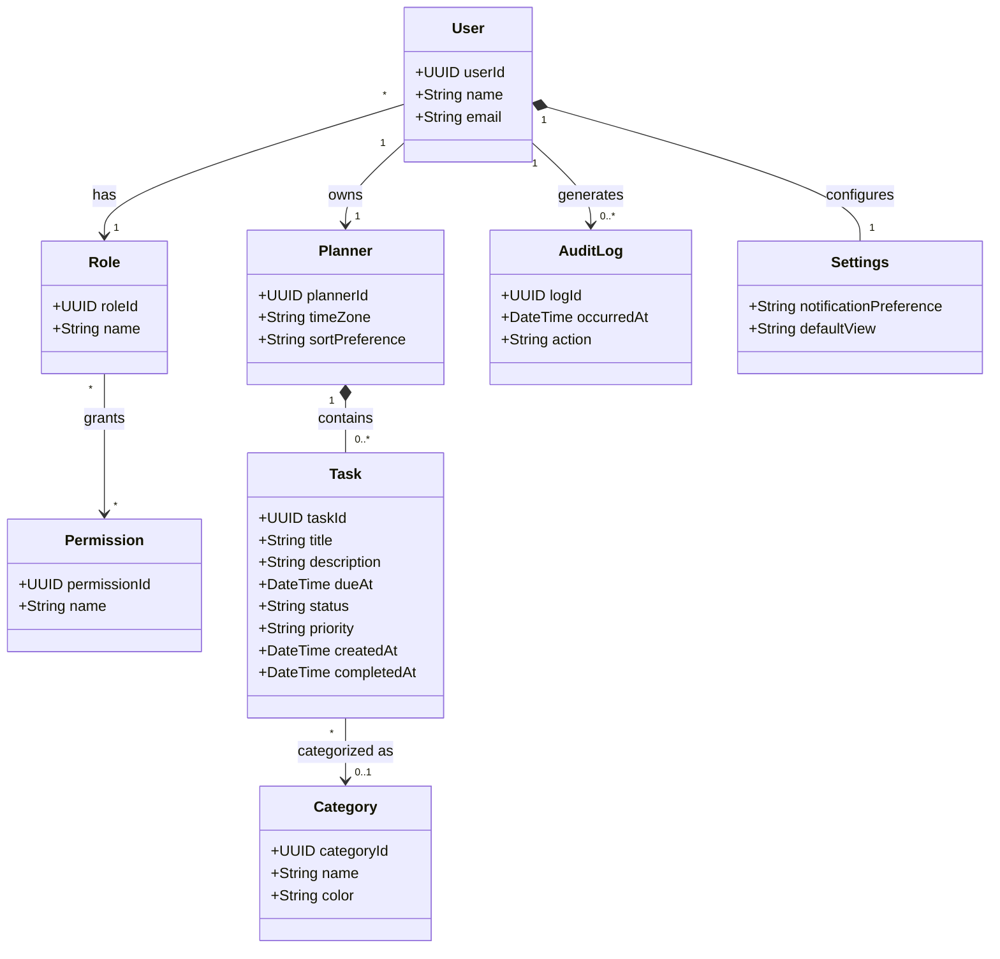

# AI-Generated First Draft: College Planner Domain Model

**Status:** Preserved first draft; not corrected after generation.

## Prompt used

> Draft a domain model for the college student planner described in the project requirements. Include likely entities, important attributes, and relationships. Show it as a Mermaid class diagram and briefly explain the model.

## Generated draft

A college planner can be modeled with users, planners, tasks, categories, roles, permissions, audit history, and user settings. Each user owns a planner and has a role. A planner contains tasks, and each task can be assigned a category. Roles grant permissions. User actions are recorded in an audit log, and each user has settings for planner behavior.

The model supports multiple accounts and access levels, task categorization and lifecycle tracking, personalized planner display, and an audit trail for user actions.
